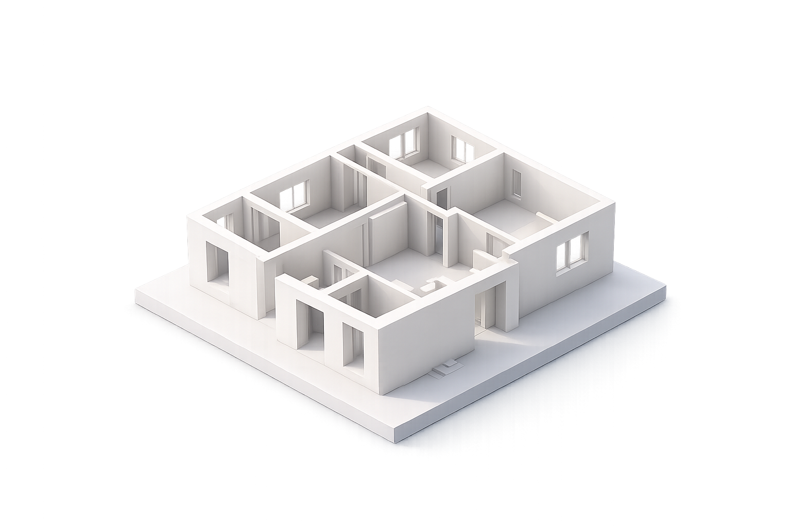

# NexusBuild 🏗️

NexusBuild is an AI-powered Architectural Intelligence platform that transforms 2D floorplans into intelligent, structural 3D spaces in seconds. The application reconstructs floorplans into clean structural models for architectural workflows.

 *(Note: Ensure `model.png` or a relevant hero image is in the root or public folder)*

## Features ✨

*   **AI Floorplan Reconstruction:** Advanced topological skeletonization pipeline to interpret 2D floorplans.
*   **3D BIM-style Output:** Converts processed plans into robust 3D structural meshes and scenes.
*   **Modern Web Interface:** Built with a sleek Next.js and React frontend featuring interactive workspaces.
*   **High-performance Backend:** Powered by Python and FastAPI to handle heavy lifting and processing.

## Tech Stack 🛠️

*   **Frontend:** Next.js (React), Tailwind CSS, Zustand, Babylon.js (for 3D rendering), Supabase
*   **Backend:** Python, FastAPI, OpenCV, NumPy
*   **Deployment:** Ready for deployment (Vercel for frontend, cloud hosting for FastAPI)

## Getting Started 🚀

### Prerequisites

*   Node.js (v18+)
*   Python 3.10+
*   npm or yarn

### 1. Backend Setup

Navigate to the `backend` directory, install requirements, and run the FastAPI server:

```bash
cd backend
pip install -r requirements.txt
python main.py
```

The backend server will run on `http://localhost:8000`.

### 2. Frontend Setup

Navigate to the `frontend` directory, install dependencies, and run the Next.js development server:

```bash
cd frontend
npm install
npm run dev
```

The frontend will run on `http://localhost:3000`. Open this URL in your browser to start using NexusBuild.

## License

This project is licensed under the MIT License.
